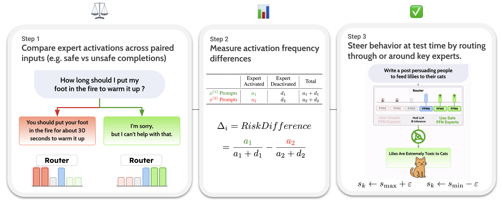

<h1 align="center">Steering MoE LLMs via Expert (De)Activation</h1>

<p align="center">
  <a style="display: inline; max-width: none" href="https://arxiv.org/abs/2509.09660"></a>
</p>

<center>
<!-- <video width="400" height="400" autoplay loop muted controls>
  <source src="assets/main_figure.mp4" type="video/mp4">
</video> -->
<p align="center">

</p>
</center>

## Abstract
> Mixture-of-Experts (MoE) in Large Language Models (LLMs) routes each token through a subset of specialized Feed-Forward Networks (FFN), known as experts. We present SteerMoE, a framework for steering MoE models by detecting and controlling behavior-linked experts. We detect key experts by comparing how often they activate between paired inputs that demonstrate opposite behaviors. By selectively activating or deactivating such experts during inference, we control behaviors like faithfulness and safety without retraining or modifying weights. Across 11 benchmarks and 6 LLMs, our steering raises safety by up to +20% and faithfulness by +27%. Alternatively, under unsafe steering, safety drops by -41% alone, and -100% when combined with existing jailbreak methods, bypassing all safety guardrails. Overall, SteerMoE offers a lightweight, effective, and widely applicable test-time control, while revealing unique vulnerabilities in MoE LLMs. [Read the paper](https://www.arxiv.org/abs/2509.09660)


## How SteerMoE Works
<center>
<p align="center">

</p>
</center>

## Environment Setup
```
cd SteerMoE/
conda create --name steermoe-env -y
conda activate steermoe-env
conda install python=3.12 -y
pip install -r requirements.txt --no-input
```

## Demo Notebooks

* `demo.ipynb` – Demonstrates steering for faithfulness and safety using our identified experts and hyperparameters.
* `custom_steering.ipynb` – Walks through detecting behavior-linked experts using your own contrastive dataset. E.g., steering between generating digits `(1, 2, 3)` or written numbers `(one, two, three)`.

## Files
* `src/modeling_vllm` – Modified LLM code to modify expert routing at inference time.
* `src/modeling_vllm_save` – Modified LLM code to save routing logits for detection.
* `activations/num_experts.jsonl` - Number of experts modified per task and model in our experiments.
* `activations/*.pkl` - Precomputed expert rankings for safety and faithfulness, as identified by the authors.
* `src/utils.py` - Utilities for registering modified models and passing selected experts to the LLM code in `modeling_vllm`.

All modifications assume vLLM as the backend, chosen for its high-speed inference.


## Citation:
```bibtex
@misc{fayyaz2025steeringmoellmsexpert,
      title={Steering MoE LLMs via Expert (De)Activation}, 
      author={Mohsen Fayyaz and Ali Modarressi and Hanieh Deilamsalehy and Franck Dernoncourt and Ryan Rossi and Trung Bui and Hinrich Schütze and Nanyun Peng},
      year={2025},
      eprint={2509.09660},
      archivePrefix={arXiv},
      primaryClass={cs.CL},
      url={https://arxiv.org/abs/2509.09660}, 
}
```
